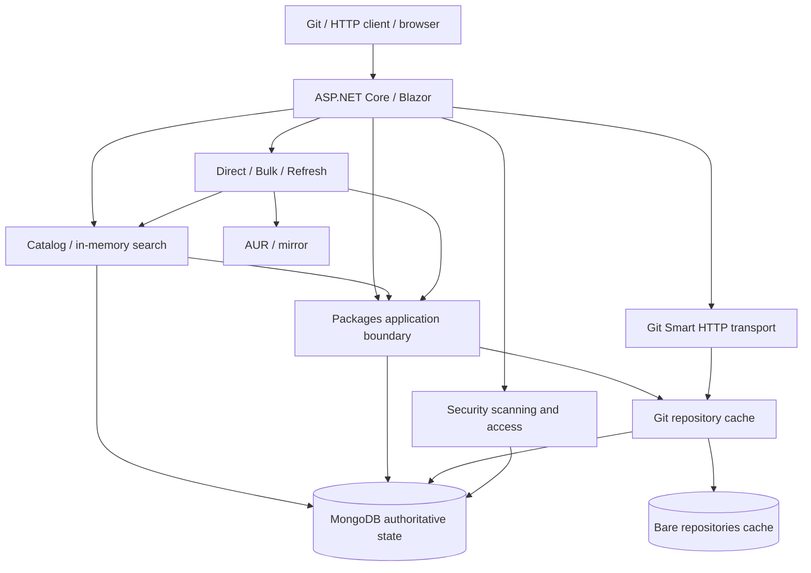

# Architecture Overview

Atoll is a self-hosted Arch Linux AUR mirror API. It downloads AUR package metadata, stores package files with revision
history, provides fast in-memory search, and exposes each package as a cloneable Git repository over HTTP.

## Context & Goals

- **Problem:** Provide a private, searchable AUR package registry with version history and Git-compatible read access to
  PKGBUILD files.
- **Scope:** Mirrors AUR metadata and package files read-only _from AUR's perspective_ - Atoll never writes upstream.
  Local mutation endpoints are unauthenticated: trusted deployments may enable them, while publicly reachable instances
  must set `Atoll:Mutations:Enabled=false`. Git push (`git-receive-pack`) and authentication are currently out of scope.
- **Success criteria:** Search queries served from memory in < 10 ms end-to-end; metadata index stays in sync with AUR
  within the configured refresh interval (default 5 minutes). Seeded content is updated only when the optional
  package-refresh worker is enabled.

## Architecture Principles

- **MongoDB is the only authoritative state** - the in-memory index and the bare repos under `data/repos/` are both
  rebuildable caches. The index is rebuilt from MongoDB on startup. Note: the index and seed workers assume a
  **single instance**; running multiple replicas duplicates AUR fetches and races on seeding until a distributed lock is
  added.
- **Domain logic lives in services, not endpoints** - `Endpoints.cs` only routes and maps; all business rules live in
  `Services/`.
- **Boundaries follow ownership** - `Catalog` owns metadata and in-memory search; `Packages` owns authoritative package
  lifecycle; `Sync` acquires package content; `Git` owns Smart HTTP and its rebuildable repository cache. Git transport
  depends on the cache rather than `IPackageService`, and package/Git persistence does not depend on Catalog internals.
- **Host policy stays visible** - `Program.cs` composes cohesive registration groups. Sync registration preserves
  defaults, registers status stores even when workers are disabled, selects one Direct/Bulk worker or none for Off, and
  shares one
  mirror between Bulk and Refresh.

## Tech Stack

| Layer | Technology | Rationale |
| --- | --- | --- |
| Runtime | .NET 10 | Current LTS runtime with built-in async primitives |
| Framework | ASP.NET Core Minimal API | Low-overhead routing; no controller boilerplate needed |
| Web UI | Blazor (Interactive Server + SSR) + Tailwind CSS v4 | Built-in web interface for catalog search, file inspection, and status dashboard |
| Database | MongoDB 8 (via MongoDB.Driver) | Flexible document model suits package metadata + per-revision content documents |
| In-memory index | ImmutableDictionary (ByNames / ByWords / ByProvides) | Fast reads with a consistent per-request snapshot, no external cache tier |
| Git subprocess | CliWrap + system `git` | Reuses the `git upload-pack` implementation |
| Containerization | Docker / Docker Compose | Single `compose.yaml` spins up API + MongoDB |
| Cloud infra | Terraform (`terraform/`) | Cloud infrastructure definitions |

## Architecture

- **PackageIndexWorker:** Periodically downloads the AUR metadata archive (`packages-meta-ext-v1.json.gz`) with
  conditional `ETag`/`Last-Modified` headers, persists new snapshots to MongoDB, and atomically swaps the in-memory
  `PackageIndexStore` snapshot. On startup, it primes the index from MongoDB so search is immediately available. When
  `DataSource:PruneDeletedPackages` is enabled, it prunes seeded packages that disappeared upstream (>10% drops require
  confirmation by a second snapshot).
- **Seed workers (Direct / Bulk):** `Seed:Mode` controls automated seeding of missing packages. Direct mode clones
  individual packages from AUR; Bulk mode batch-fetches branches from the GitHub AUR mirror into a local cache.
- **PackageRefreshWorker:** Periodically checks already-seeded packages against upstream Git HEADs, appending new
  revisions only when content changes. Shares the mirror cache with Bulk seeding.
- **PackageSecurityWorker:** Scans newly seeded or refreshed revisions using deterministic static analysis, gating
  content and Git access until verified. On startup, automatically invalidates and requeues scan results from older
  or unversioned policy versions. The pending queue is policy-aware: each document carries the minimum scanner
  policy that may claim and persist it, so a rolling deployment cannot let an older worker claim, complete, or
  downgrade work that a newer policy already claimed.
- **PackageSearchService:** Serves Atoll-native search queries in-memory from `PackageIndexStore` snapshots with zero
  database I/O.
- **AurRpcService:** Maps the same immutable metadata snapshot to the aurweb RPC v5 contract used by yay and paru. It
  also resolves split-package `pkgbase` Git requests to seeded Atoll package names.
- **Blazor Web UI:** Razor components under `Components/` provide a fast, responsive UI:
  - `PackageCatalogService`: Powers `/` with cached pre-sorted views, live filtering, and server-side pagination.
  - `PackageDetailsService`: Assembles package metadata, relations, file trees, and security verdicts.
  - `StatusDashboardService`: Aggregates worker statuses, sync metrics, and exclusions for `/status`.
- **Git services:** `GitTransferService` handles `git upload-pack` streams only. `GitRepositoryCache` owns repository
  paths, per-package locks, markers, materialization, and deletion. It synthesizes deterministic commits from retained,
  servable revisions; their SHAs are distinct from both Atoll revision IDs and upstream AUR commits.
- **Package name semantics:** `{name}` in routes is always the AUR **pkgname**. When interacting with Git mirrors or
  AUR, Atoll maps `pkgname` to its parent **pkgbase** using the in-memory index
  (`DirectPackageSeeder.ResolvePackageBase` for manual/direct seeding; the bulk and refresh candidate planners
  resolve it from the same index), correctly handling split packages.

Request paths of note (everything else is standard Minimal API routing with `GlobalExceptionHandler` converting
unhandled exceptions to RFC 9457 `ProblemDetails`):

- **Web UI:** Blazor routes (`/`, `/package/{name}`, `/package/{name}/files`, `/package/{name}/revisions`, `/status`)
  map to Razor components rendering interactive and static SSR pages directly backed by `PackageCatalogService`,
  `PackageDetailsService`, and `StatusDashboardService`.
- **Search:** `PackageSearchService` reads the current immutable `PackageIndexStore` snapshot and returns results with
  no I/O.
- **Package CRUD:** `PackageService` delegates to `MongoPackageRepository`; seeding is orchestrated by
  `DirectPackageSeeder` (`Services/Sync/Direct`), which fetches the AUR Git tree to a temp directory, reads the
  files, and persists them to MongoDB via `IPackageService.SeedFilesAsync`.
- **AUR RPC v5:** `AurRpcService` serves legacy GET or form-encoded POST requests at `/rpc` and path-style `/rpc/v5/…`
  requests from the in-memory catalog. Responses expose Atoll's standard `/{pkgbase}.git` aliases as `URLPath`.
- **Git Smart HTTP:** `GitTransferService` asks `IGitRepositoryCache` for a current bare repository, then pipes
  stdin/stdout to `git upload-pack`. Materialization reads package revisions and scan status without mutating package
  data. Standard root-level `/{pkgbase}.git` aliases coexist with Atoll's `/packages/{name}.git` routes; split-package
  bases resolve to the first seeded member in deterministic name order.

## State & Storage

- **MongoDB (authoritative):**
  - `packages` — Root package documents. Stores metadata, embedded revision headers (ID, author, timestamp, message),
    `headRevisionId` pointer, and refresh sync watermarks (`upstreamPackageBase`, `lastSyncedUpstreamHead`,
    `lastSyncAttemptAt`, `lastSyncSucceededAt`, `lastSyncError`). Indexed on `packageName` at startup.
  - `package-revisions` — Normalized snapshot file content (one document per retained revision, keyed by
    `{packageName}:{revisionId}`). History length does not bloat root package documents; snapshots are capped by
    MongoDB's 16 MiB BSON limit.
  - `package-security-scans` — Security state and findings per revision (keyed by `{packageName}:{revisionId}`).
    Indexed on `(status, requiredPolicyVersion, leaseUntil)` for the policy-aware scanner work queue,
    `(packageName, isHead)` for head lookups and package-scoped reads, and `(isHead, status, packageName)` so the
    package catalog's head-status projection and the status dashboard's per-status counts are served from the index
    without fetching documents that carry findings.
  - `seed-exclusions` — Records pkgbases whose revision content exceeds the 16 MiB document limit, preventing endless
    retries during seed and refresh.
  - `aur-metadata` — Raw AUR metadata dump snapshots.
- **In-memory index (cache):** `PackageIndexStore` maintains an immutable snapshot of `ByNames`, `ByWords`, and
  `ByProvides` lookup tables. Rebuilt on startup from MongoDB and swapped atomically on metadata refresh.
- **On-disk Git repos (cache):** Bare repositories under `data/repos/` (configurable via `Atoll:Git:RepositoriesPath`),
  lazily materialized from `package-revisions`. Re-materialized whenever the head revision or security status changes.
- **Limits & containment:**
  - `MaxRevisions` (default 10) caps retained revision history per package.
  - `MaxFileBytes` (default 5 MB) is enforced on UTF-8 content bytes; each file stores its SHA-256 hash.
  - Revision IDs hash the package name plus ordinally sorted file names and hashes, independent of input order.
  - The 16 MiB BSON limit applies per revision document. A conservative estimate avoids routine serialization; documents
    near the limit are measured exactly. Oversized packages are recorded in `seed-exclusions`.
  - Disk growth for bare repos is unbounded (~116k bare repos if full AUR is seeded). Use `Seed:Mode=Off` or monitor
    storage/inodes.

## API

- **Base URLs:** `http://localhost:8080` (container), `http://localhost:5290` (dev)
- **Style:** REST, JSON · **Authentication:** none (open read/write; trusted networks only) ·
  **Versioning:** URL segment (`/v1/…`) via `Asp.Versioning` · **Error format:** RFC 9457 `ProblemDetails`
- **Version semantics:** The JSON REST surface (`/v1/search`, `/v1/packages/…`) is versioned by URL segment;
  unversioned paths and unknown versions (`/v2/…`) return `404`. Responses advertise supported versions via the
  `api-supported-versions` header. Protocol-fixed surfaces stay version-neutral: AUR RPC (`/rpc`, `/rpc/v5/…`) and
  Git Smart HTTP (`/packages/{name}.git`, `/{name}.git`) are built by yay/paru and git clients, which cannot carry
  an API version segment; `/health` and `/metrics` are operational endpoints.
- **OpenAPI:** One document per API version, served by `MapOpenApi().WithDocumentPerVersion()` (e.g.
  `/openapi/v1.json`). Minimal API handlers use typed results so response status codes and JSON models are inferred.
  `GET /v1/packages/{name}/security` documents its history and single-revision `200` payloads with `oneOf`;
  `ProducesJsonOneOf` supplies this metadata because ASP.NET Core 10 otherwise retains only one response type per
  status code and content type. Revisit the helper when upgrading to .NET 11, which supports this composition
  natively.

### Search parameters

`/v1/search` accepts two query parameters:

- `query` - a comma-separated list of values (e.g. `?query=linux,zen`). An omitted or empty query deliberately returns
  `200` with no results rather than `400`.
- `by` - `name` (exact match), `words` (token intersection over Name/Description/Keywords, ordered by votes, capped at
  50), or `provides` (currently no cap or defined ordering - asymmetry worth resolving). Defaults to `name`.

### Endpoints

| Method | Path | Description |
| --- | --- | --- |
| GET/HEAD | `/health` | Liveness only - does not check MongoDB or index readiness (version-neutral) |
| GET | `/metrics` | OpenTelemetry metrics in Prometheus format (see Operations; version-neutral) |
| GET | `/v1/search?query=…&by=name\|words\|provides` | In-memory package search (comma-separated values) |
| GET/POST | `/rpc` | aurweb-compatible RPC v5 endpoint for yay/paru (version-neutral) |
| GET | `/rpc/v5/{operation}/…` | Path-style aurweb RPC v5 endpoint (version-neutral) |
| GET | `/v1/packages` | List all seeded package names |
| POST | `/v1/packages/{name}/seed` | Clone from AUR and persist (409 if exists). `403` when `Atoll:Mutations:Enabled=false` |
| GET | `/v1/packages/{name}` | Get head revision files |
| GET | `/v1/packages/{name}/versions` | Get revision history |
| GET | `/v1/packages/{name}/versions/{sha}` | Get specific revision files |
| DELETE | `/v1/packages/{name}` | Delete package data, security scans, and materialized Git repo. `403` when `Atoll:Mutations:Enabled=false` |
| GET | `/v1/packages/{name}/security` | Get per-revision security status (`?revision={sha}` for one revision) |
| POST | `/v1/packages/{name}/security/rescan` | Mark a revision for re-scan (`?revision={sha}`, defaults to head). `403` when `Atoll:Mutations:Enabled=false` |
| GET | `/packages/{name}.git/info/refs?service=git-upload-pack` | Git ref advertisement (version-neutral) |
| POST | `/packages/{name}.git/git-upload-pack` | Git pack negotiation and transfer (version-neutral) |
| GET/POST | `/{pkgbase}.git/...` | AUR-compatible aliases for the same Git Smart HTTP operations (version-neutral) |

### Web UI routes

| Path | Render Mode | Description |
| --- | --- | --- |
| `/` | Interactive Server | Package catalog search, live filtering (all/seeded/unseeded), and sorting |
| `/package/{name}` | Static SSR | Package details, metadata, relationships, clone block, security banner |
| `/package/{name}/files` | Static SSR | PKGBUILD and source file viewer across revisions (client-side syntax coloring via self-hosted highlight.js) |
| `/package/{name}/revisions` | Static SSR | Revision history list and static security analysis findings |
| `/status` | Static SSR | Operational dashboard: index sync, workers, security scans, exclusions |

Helper setup and RPC/Git compatibility details are documented in [Using yay and paru](AUR_HELPERS.md).

`DELETE` removes derived scan/cache state before authoritative package data, so failures remain retryable. Cache cleanup
and package deletion hold the same per-repository lock used by materialization, preventing a concurrent request from
resurrecting the repository. `GitTransferService` also verifies that the MongoDB package still exists before serving it.

### Security scanning

Seeded AUR content is untrusted. Atoll uses deterministic static analysis and a durable per-revision scan state to gate
content and Git access; search, package lists, history, and security status remain available as metadata. New and
refreshed revisions are blocked until they verify. The full threat model, scan rules, worker pipeline, access decisions,
configuration, and limitations are documented in [Package security scanning](SECURITY.md).

## Key Decisions (ADRs)

| Decision | Rationale | Trade-offs | Status |
| --- | --- | --- | --- |
| In-memory search index (no Elasticsearch) | Fast reads (< 10 ms); full AUR metadata fits easily in RAM (~100 MB). | Must rebuild on restart; no fuzzy scoring. | Active |
| Normalized `package-revisions` storage | Avoids 16 MiB document growth as revisions accumulate; keeps `packages` documents lean. | Content reads take an extra indexed query; two-document writes on append without distributed transactions. | Active |
| Subprocess execution for `git upload-pack` | Reuses complete and standard Git smart HTTP protocol implementation. | Requires `git` binary in container; small process-spawn overhead per Git fetch. | Active |
| Atomic snapshot swap in `PackageIndexStore` | Lock-free, zero-contention reads; consistent view per query. | Full index rebuild on refresh; temporary 2× peak memory during rebuild. | Active |
| Cached sorted views in `PackageCatalogService` | Fast UI pagination over 100k+ packages. Each `(generation, sort)` is pre-sorted once into an array reference. | First request per sort pays O(N log N). Substring queries still scan linearly (~15–25 ms). | Active |
| Response compression (Brotli + Gzip) | Reduces dynamic SSR and API payload sizes ~5× without external infrastructure. | Minor CPU overhead (mitigated by `Fastest` level). Disabled over HTTPS by default to prevent BREACH attacks. | Active |
| Open endpoints / Trusted network model | Keeps the API and Git clone surface simple and standard for self-hosted instances. | Anyone on the network can mutate data unless `Atoll:Mutations:Enabled=false` is set. | Active |
| URL-segment REST versioning (`Asp.Versioning`) | The JSON REST surface evolves without breaking pinned clients: `/v1/…` reserves the contract, and a future breaking revision ships side-by-side as `/v2/…`. Query/header readers are disabled so the version is unambiguous and cache-friendly. | AUR RPC, Git Smart HTTP, `/health`, and `/metrics` stay version-neutral forever (client-built URLs); unsupported or unversioned paths `404`. Breaking move off the old unversioned `/search` and `/packages` paths. | Active |

Security notes not covered by the ADRs: options are validated on startup via Data Annotations (`[Required]`, `[Range]`,
`[Url]`); raw stack traces are never returned to clients; `git-receive-pack` (push) is explicitly rejected with
`403 Forbidden`.

**Git identity compatibility:** commit identity depends on ordered revisions, trees and executable modes, sanitized
revision authors, timestamps, messages, and parent order. The `git-v2` marker introduced corrected author identities;
older local caches rebuild lazily and receive new synthesized SHAs once.

## Operations

- **Deployment:** `Atoll.Api/Dockerfile` builds the image (installs the `git` CLI); `compose.yaml` orchestrates API +
  MongoDB 8 with a health check on Mongo. Named volumes `atoll-data` (Git repos) and `mongo-data` persist state.
  Single-instance only (see Principles).
- **Configuration:** `appsettings.json` + Data Annotation validation for local dev; 12-factor environment variables for
  containers (see `compose.yaml` for an example).
- **Logging:** ASP.NET Core structured console logging; workers log seeding progress, refresh status, and errors.
  `Activity.Current?.Id` is captured in error logs for correlation.
- **Metrics:** `GET /metrics` serves OpenTelemetry metrics in Prometheus exposition format. Custom `atoll_*`
  instruments cover process uptime, search request count, index sizes (by names / provides / words), AUR refresh
  statistics (attempts, successes, failures, last timestamps), bulk-seed statistics, security-scan statistics
  (throughput, outcomes, backlog depth), and package-refresh statistics; ASP.NET Core request metrics, outbound
  HTTP client metrics (AUR / mirror fetches via `OpenTelemetry.Instrumentation.Http`), and built-in .NET runtime
  metrics are included. Alerting is not configured; intended for the infrastructure layer.
- **Telemetry export:** Metrics and application logs are also exported over OTLP via `UseOtlpExporter()`,
  configured through `OTEL_EXPORTER_OTLP_*` environment variables. `compose.yaml` bundles the
  `grafana/otel-lgtm` development stack (OTel Collector, Prometheus, Loki, Tempo, Grafana) with a provisioned
  Atoll dashboard (`observability/grafana/`).
- **Health:** `/health` is liveness only. There is no readiness signal - the search index may be empty on first requests
  after a cold start, and `/health` does not verify MongoDB connectivity.

## Follow-up work

- Add periodic full verification for pkgbases unavailable from the mirror; direct-AUR fallback is already used when a
  mirror branch is unavailable.
- Expand scanner coverage, add source-host policy, and add manual overrides. Git already excludes pending, flagged,
  errored, and unscanned historical revisions while security is enabled.
- Evaluate content-addressed deduplication or GridFS/chunked storage for revision snapshots larger than MongoDB's 16 MiB
  document limit.
- `PackageCatalogService` substring queries and seeded/security filters still scan the full sorted view on every call
  (~15–25 ms at ~85k packages, even for a single-hit query) - a real substring/prefix index would be needed to remove
  this floor. Empty-query default views bypass the scan via the per-sort cached sorted views (2026-08-23; replaced the
  earlier top-K heap).

## References

- AUR package metadata dump: `https://aur.archlinux.org/packages-meta-ext-v1.json.gz`
- AUR RPC interface: `https://aur.archlinux.org/rpc`
- Git Smart HTTP protocol: `https://git-scm.com/docs/http-protocol`
- Local setup and quickstart: see [README](../README.md)
- Development setup and local tooling: see [DEVELOPMENT.md](DEVELOPMENT.md)
- Package seeding and refresh: see [SYNC.md](SYNC.md)
- Package security scanning: see [SECURITY.md](SECURITY.md)
- Deployment guide: see [DEPLOYMENT.md](DEPLOYMENT.md)
